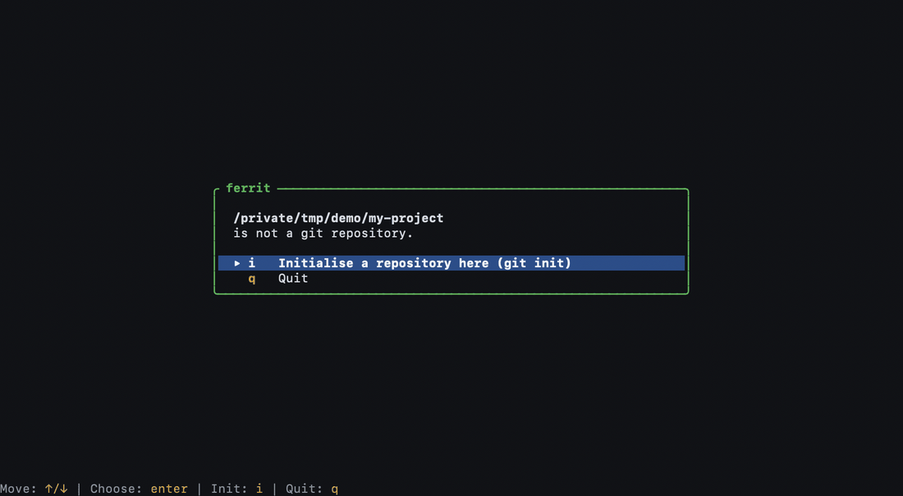

# ferrit

A lazygit-style terminal UI for git, written in Rust.

`ferrit` brings a fast, keyboard-driven TUI to everyday git work: staging hunks,
crafting commits, browsing branches and the reflog, resolving conflicts, and
running interactive rebases without leaving the terminal.

> Status: early development. Not usable yet.

## Ferrit vs lazygit

Both tools cover the core Git workflow. Ferrit's differentiator is a
repository-aware profile and identity layer, with author selection built into
the commit flow.

| Capability | ferrit | lazygit | Difference |
| --- | :---: | :---: | --- |
| Stage files, hunks and lines | ✅ | ✅ | Shared core workflow |
| Interactive rebase | ✅ | ✅ | Shared core workflow |
| Stash, branches, conflicts and remotes | ✅ | ✅ | Shared core workflow |
| Choose Git author from configured identities | ✅ | ❌ | In the commit popup, `Ctrl-A` cycles the identities git knows and git's own; for this run only, git config is not touched |
| Settings sheet | ✅ | ❌ | Click the author's name: a Terminal, Dark or Light theme (Dark and Light paint the whole screen), accent colour with a colour picker, mouse, wheel step, diff context, sign-off and command log, each saved to `config.toml` as you change it |
| Repository statistics dashboard | ✅ | ❌ | `D`, a sheet over the dimmed panes: activity over time, contributors, kinds of change, hot files, branch health, with charts |
| Edit Git config from the interface | ✅ | ❌ | `C`: every key with its scope and origin, edited through `git config`, secrets hidden |
| Start in a folder that is not a repository | ✅ | ❌ | A welcome screen offers `git init` after a question that names the folder; `--path` keeps the error |
| Create the remote repository from the interface | ✅ | ❌ | `G` (or `x`) with no remote: GitHub through `gh`, private by default, then push |
| Custom commands | ⚠️ | ✅ | Planned for Ferrit; lazygit supports user-defined commands |
| Worktree management | ⚠️ | ✅ | Planned for Ferrit; lazygit has built-in worktree actions |
| Gitflow integration | ⚠️ | ✅ | Planned for Ferrit; available in lazygit when Gitflow is installed |
| Git bisect workflow | ⚠️ | ✅ | Planned for Ferrit; built into lazygit's documented commit actions |

✅ available · ⚠️ planned. Comparison covers built-in features. lazygit can be
extended with custom commands; Ferrit is focused on an identity-aware Git
workflow.

## Why

- **Fast**: native Rust, no runtime, instant startup.
- **Keyboard first**: every action reachable without the mouse.
- **Readable diffs**: syntax-aware, hunk-level staging.
- **Safe**: destructive actions always ask first.

## Install

```bash
cargo install ferrit
```

Requires Rust 1.85+ (edition 2024).

## Usage

```bash
ferrit          # open the TUI in the current repo
```

Press `?` inside the app for the keybinding cheatsheet, `x` (or a right
click) on a row for the less common actions, `@` for the git commands ferrit
ran.

## Configuration

`ferrit --config-path` prints where the settings file lives. Everything is
optional; a wrong value is reported at startup and only that part falls back
to its default.

```toml
[theme]
base = "dark"            # or "light"
preset = "green"         # the accent: green, blue, purple, amber

[theme.colors]           # any of the 14 palette colours, "#rrggbb" or a name
add_line_bg = "#d6f5d6"

[ui]
mouse = true
wheel_step = 3
poll_secs = 10

[diff]
context = 3
ignore_whitespace = false

[commit]
sign_off = false

[log]
show_reads = false

[keys.global]            # remap any key but ctrl-c; also files, diff,
quit = "Q"               # branches, commits and stash
```

The help screen and the key hints follow the remapped keys.

## Building from source

```bash
git clone https://github.com/ferrit-rs/ferrit
cd ferrit
cargo run
```

## Contributing

Contributions welcome. All commits must be signed off (DCO):

```bash
git commit -s -m "your message"
```

By signing off you certify the [Developer Certificate of Origin](https://developercertificate.org/).

See [`CONTRIBUTING.md`](CONTRIBUTING.md) for setup, checks, testing, and pull
request guidelines.

See [`MAINTAINERS.md`](MAINTAINERS.md) for the people maintaining this project.

## License

MIT. See [`LICENSE`](LICENSE).
